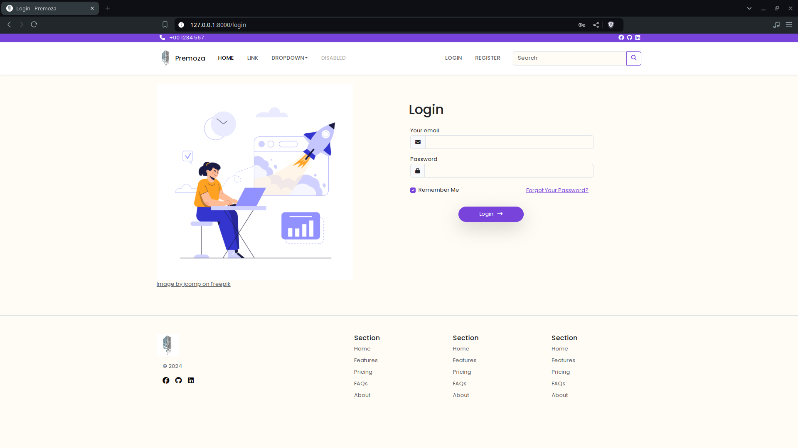
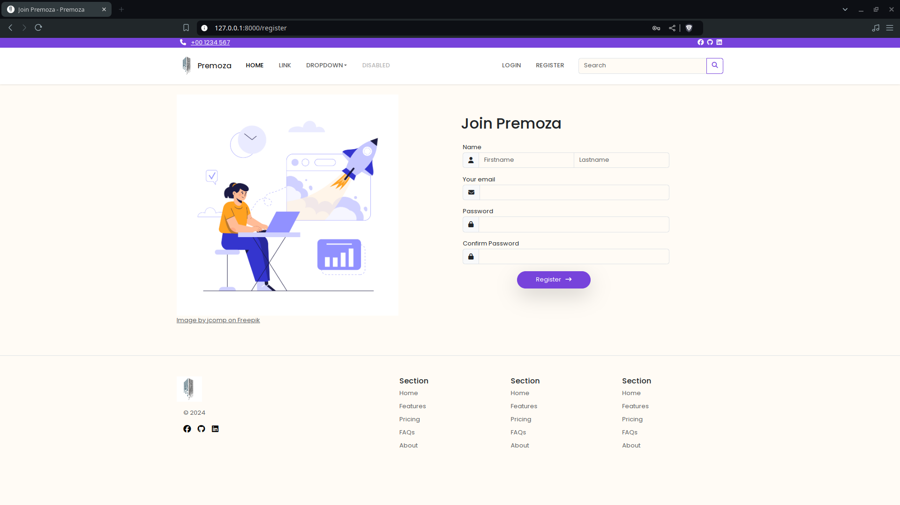

# premoza
🚧 under development, contributions are welcome




## Pre-requisites
- XAMPP or mysql cli
- Node.js v20.^
- PHP v8.2.^
- Laravel v11.^ & Composer
  
## Setting up
- install dependecies
  ```
  composer install && npm install
  ```
- create environment
  ```
  cp .env.example .env
  ```
- generate app key
  ```
  php artisan key:generate
  ```
- launch xampp & start mysql
  > or use the mysql cmd line interface
- database migration
  ```
  php artisan migrate
  php artisan db:seed
  ```

## Start application
- start vite
  ```
  npm run dev
  ```
- start laravel
  ```sh
  php artisan serve
  ```

## Refresh migration
```
  php artisan migrate:refresh
  php artisan db:seed
```

## Refresh cache
```
  php artisan config:cache
```
